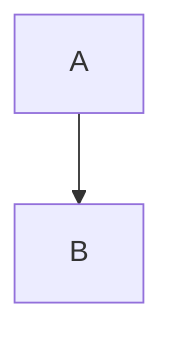

# All Syntax Fixture

## Inline styles

Paragraph with **bold**, *italic*, ~~strikethrough~~, ==highlight==, and `inline code`.
Hard line break follows.
Next line after hard break.

Link: [OpenAI](https://openai.com)

Image: 

Inline HTML: <span>html</span>

## Blockquote + lists

> Blockquote intro
>
> - quoted item 1
> - quoted item 2
>
> End quote

- unordered item
  - nested item

1. ordered item
2. ordered item

---

## Headings depth

### H3 title

#### H4 title

##### H5 title

###### H6 title

## Tables (may fallback to plain text)

| Col A | Col B |
|------:|:------|
| A1    | B1    |
| A2    | B2    |

## Task list (may fallback to plain text)

- [x] done task
- [ ] pending task

## Autolinks (may fallback)

<https://openai.com>
<mailto:test@example.com>

## HTML block (may fallback)

<div>
  <strong>Block HTML</strong>
</div>

## Nested blockquote + code

> level 1
> > level 2
> >
> > ```js
> > console.log('nested')
> > ```

Normal paragraph after nested quote.

## Mixed lists

1. ordered item
   - nested unordered
     - deeper nested
   - [x] nested task
2. ordered item 2

## Reference-style links (may fallback)

This is a [ref link][openai].

[openai]: https://openai.com "OpenAI Title"

## HTML comments (may fallback)

<!-- comment should not crash -->

## Code fence edge cases

```md
This fenced block contains backticks: ``` and should stay inside.
```

## Math

Inline math: $E = mc^2$.

$$
\int_0^1 x^2 \, dx
$$

## Code

```ts
const x = 1
console.log(x)
```



## Footnotes + reference

Footnote reference here[^note].

[^note]: Footnote text with **bold** and a link to [OpenAI](https://openai.com).

Reference [1]
